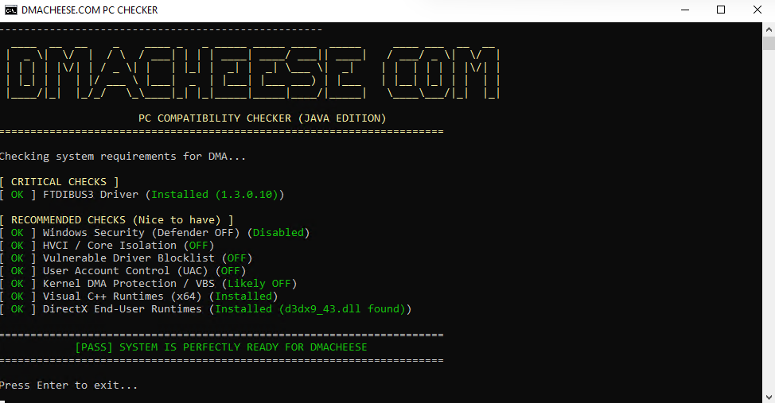

# PC Check - DMA Compatibility Checker (Java Edition)

A Windows console application that verifies system compatibility for DMA hardware. Built with **Java** and **JNA** (Java Native Access) for direct Windows API interaction.



## Features

- **FTDI FT601 Driver Detection** - Verifies the correct USB 3.0 bridge driver is installed
- **Windows Security Checks** - Detects Defender, HVCI, UAC, and VBS settings
- **Automatic Fixes** - Offers to fix incompatible settings (requires Administrator)
- **Colored Console Output** - Clear pass/fail indicators using Windows Console API
- **Cross-version Compatible** - Works on Java 8 through Java 21+

## Requirements

- Windows 10/11
- Java 8 or higher (JRE)
- Administrator privileges (for fixes)

## Quick Start

### Option 1: Pre-built Distribution
1. Download the latest release
2. Extract to any folder
3. Run `run.bat` as Administrator

### Option 2: Build from Source
```bash
# Clone repository
git clone https://github.com/riqqq/pc-check-java.git
cd pc-check-java

# Build distribution (requires JDK 17+)
build_dist.bat

# Copy 'dist' folder to target machine
```

## Architecture

```
src/main/java/com/dmacheese/pccheck/
├── Main.java              # Application entry point
├── ConsoleRunner.java     # Main application flow
├── SystemCheckService.java # System check implementations
├── FixService.java        # Automated fix implementations
└── Utils.java             # Console utilities (colors, admin check)
```

### Design Patterns

- **Dependency Injection** - Services are constructor-injected into ConsoleRunner
- **Service Layer** - Business logic separated from presentation
- **Single Responsibility** - Each class has a focused purpose

## Technology Stack

| Component | Technology |
|-----------|------------|
| Language | Java 8+ |
| Native Access | JNA 5.13+ |
| Build | Manual javac (portable) |
| Target OS | Windows 10/11 |

## System Checks Performed

| Check | Registry/API | Pass Condition |
|-------|--------------|----------------|
| FTDI Driver | SetupAPI | FT601 device with v1.3.0.8/10 |
| Windows Defender | Registry | Real-Time Protection OFF |
| HVCI | Registry | Core Isolation OFF |
| Driver Blocklist | Registry | Disabled |
| UAC | Registry | Disabled |
| VBS/DMA Protection | Registry | Not enabled |
| VC++ Runtimes | Registry | x64 installed |
| DirectX | File system | d3dx9_43.dll exists |

## License

MIT License - See [LICENSE](LICENSE) for details.

## Contributing

1. Fork the repository
2. Create a feature branch
3. Submit a pull request

---

*Built for the DMA enthusiast community by [DMACHEESE.COM](https://dmacheese.com)*
